<div align="center">
  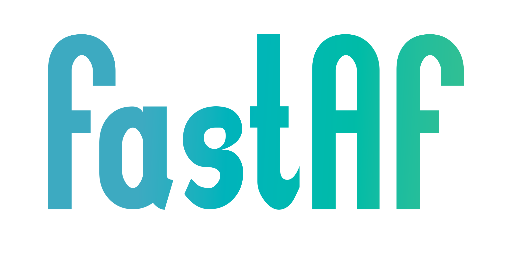

  <h1>FastAF — Fast Accurate Finder</h1>
  <p>Real-time drug detection over WebSocket using YOLOv11, powering a touch-to-identify camera feature for a pharmacy management system.</p>

  
  
  
  
  
  
</div>

---

## Overview

FastAF is a pharmacy management system consisting of three components that share a single cloud backend:

- **Web dashboard** — for pharmacists and managers to view sales analytics, manage pharmacy branches, and create employee accounts
- **Mobile application** — for pharmacy employees to handle sales, monitor drug inventory, track expiry dates, and order shortage drugs
- **AI detection server** — this repository — a cloud inference server that receives live camera frames from the mobile app and returns real-time drug detection results

This repository covers the AI detection server exclusively — the model training pipeline, deployment implementation, and the dataset that powers it.

---

## The AI Feature — Touch-to-Identify

The mobile app's sales screen opens the phone camera so employees can identify drugs on the counter without scanning a barcode. The detection happens entirely in the cloud: the app streams frames over a WebSocket connection to the inference server, which returns bounding box coordinates for every drug detected in the frame. The employee then taps anywhere on the screen where a drug is shown. If their tap falls inside a detection box, that drug's ID is sent to the backend, its information is retrieved, and it is added to the customer's cart.

The server does not return boxes to be drawn on screen. Instead, each detection in the response includes three coordinate points:

- `leftmost` / `rightmost` — the bounding box corners used internally to check whether the user's tap falls inside a detection
- `notify_point` — a small indicator point rendered on screen (at 25% from the top-left of the box) so the employee knows the object has been identified, without cluttering the live camera view with full bounding boxes

<div align="center">
  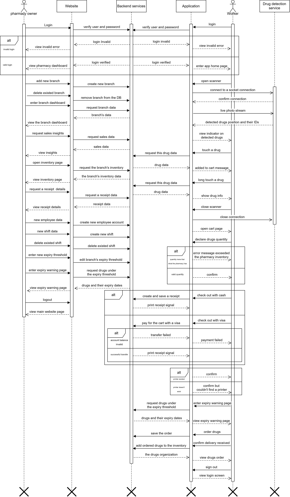
  <p><i>Sequence diagram — flow between mobile app, website, AI detection server, and backend</i></p>
</div>

---

## System Architecture

The AI server sits between the mobile application and the pharmacy backend. The mobile app streams JPEG-encoded frames over WebSocket, the server runs ONNX inference, and returns structured JSON with detection coordinates. The backend is responsible for all drug data lookups — the AI server only handles detection.

```
Mobile App
      │
      │  WebSocket — JPEG frames
      ▼
AI Detection Server  ◄── This repository
  FastAPI + ONNX Runtime + YOLOv11m
      │
      │  JSON — detection boxes + notify points
      ▼
Mobile App
      │
      │  HTTP — tap coordinates + detection_id
      ▼
Pharmacy Backend API
      │
      │  Drug info → Cart
      ▼
Mobile App
```

---

## Model Development

Four YOLOv11 models were trained iteratively, improving dataset quality, augmentation strategy, and hyperparameters across each version. All training was done on Google Colab using a Tesla T4 GPU.

For full training details, per-model analysis, dataset version history, and per-class metrics see [`model_development/model_training/README.md`](model_development/model_training/README.md).

### Model Comparison

| | Model 1 | Model 2 | Model 3 | Model 4 ✅ |
|---|---|---|---|---|
| **Architecture** | YOLOv11m | YOLOv11m | YOLOv11s | YOLOv11m |
| **Optimizer** | SGD | SGD | SGD | AdamW |
| **Dataset version** | v1 | v3 | v4 | v4 |
| **Training images** | 3,345 | 1,445 | 7,065 | 7,065 |
| **mAP50** | 0.942 | 0.963 | 0.977 | **0.980** |
| **mAP50-95** | 0.830 | 0.829 | 0.852 | **0.856** |
| **Precision** | 0.904 | 0.920 | 0.958 | 0.955 |
| **Recall** | 0.904 | 0.922 | 0.945 | **0.965** |
| **Inference** | ~11ms | ~11ms | ~5ms | ~11ms |
| **Weight size** | 40.6 MB | 40.6 MB | 19.2 MB | 40.6 MB |

### Production Model — Model 4

Model 4 (YOLOv11m, dataset v4, AdamW optimizer) is the production model. It achieved **0.980 mAP50** and **0.856 mAP50-95** across 46 drug classes. Switching to AdamW with a lower learning rate (0.0003) and extending the close_mosaic window to 70 epochs pushed recall from 0.945 to 0.965 over model 3 — meaning the model misses fewer drugs in cluttered real-world conditions, which is the critical failure mode for a sales environment.

Model 3 (YOLOv11s) is a strong lightweight alternative — only 0.003 mAP50 behind, half the size, and twice the inference speed — suitable if the deployment environment becomes resource-constrained.

<div align="center">
  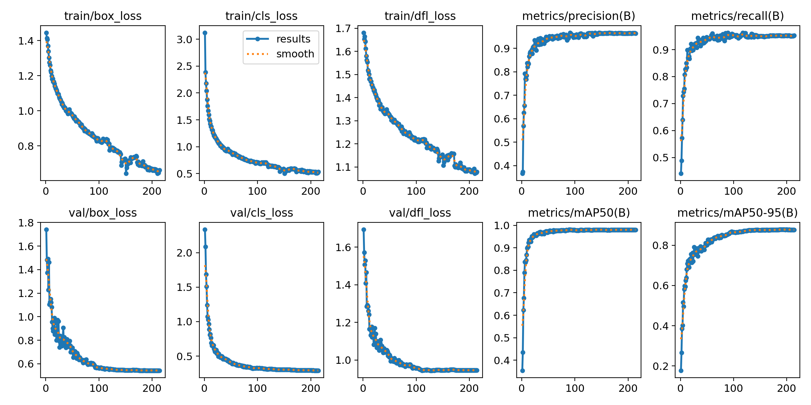
  <p><i>Model 4 training and validation curves over ~214 epochs</i></p>
</div>

<div align="center">
  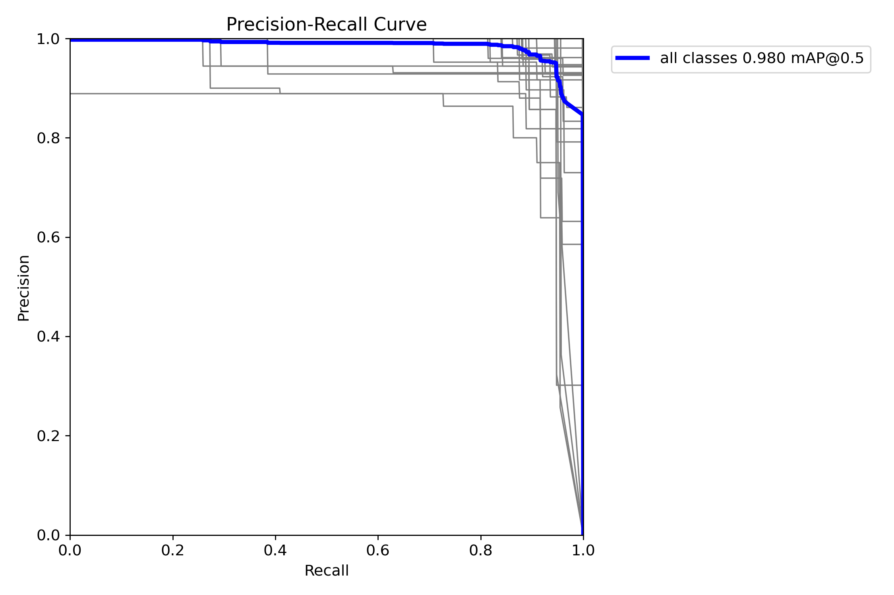
  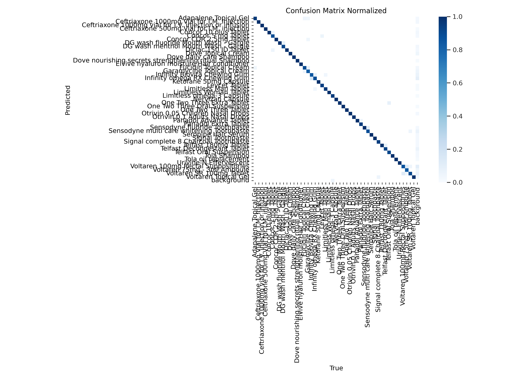
</div>

---

## Dataset

The model was trained on a custom drug detection dataset built specifically for this project, hosted on Roboflow.

**[FastAF Drug Detection Dataset — Roboflow](https://universe.roboflow.com/test-c1hxb/fastaf/dataset/4)**

**46 drug classes** — Egyptian pharmacy products covering antibiotics (Ceftriaxone variants), anti-inflammatories (Voltaren variants, Diclac), antihistamines (Telfast variants, Levcet), nasal drops (Otrivin variants), cardiac drugs (Concor variants), oral care (Sensodyne, Signal, DG Wash variants), hair care (Dove, Tola, Elvive, Seropipe), topical creams (Fucidin, Garamycine, Dove), supplements (Limitless, Infinity, Nervizan), and others.

### Data Collection

The dataset was built from two sources:

- **1,868 photos captured manually** using 3 different phones, across varied real-world conditions: different lighting environments, cluttered backgrounds with unrelated objects, multiple angles and positions per drug, and some images with partially damaged packaging. These photos were collected across multiple rounds — earlier dataset versions (v1, v3) contain a subset of these images, with v4 containing the full collection.
- **1,041 photos scraped from the web** using SerpAPI, used to supplement underrepresented classes.

All images were manually annotated using Roboflow's annotation tool.

### Why These Drugs Are Hard to Detect

The classes were deliberately chosen to stress-test the model:

- **Near-identical packaging across variants** — 4 Voltaren types (Topical Gel, 75mg Ampoule, SR 100mg Tablet, 100mg Suppository), 3 Ceftriaxone vials (1000mg I.M., 1000mg I.V., 500mg I.M.), 3 Concor tablets, 2 Otrivin drops (distinguished only by concentration text), 3 Telfast formulations
- **Flexible and non-box packaging** — Dove Topical Cream, Seropipe Hair Serum, Limitless supplement bottles
- **Multi-SKU classes** — Sensodyne Fluoride in 20ml, 50ml, and 100ml tubes are treated as a single class. The model detects drug identity; the pharmacy backend handles SKU-level pricing per branch.

### Dataset Versions

| Version | Training | Validation | Notes |
|---------|----------|------------|-------|
| v1 | 3,345 | 278 | Roboflow augmentation (flip, rotation, salt & pepper noise) — 3× source images |
| v3 | 1,445 | 254 | Smaller clean dataset, augmentation applied during training |
| v4 | 7,065 | 442 | Full dataset — all manually captured images included, Roboflow augmentation: rotation, brightness, Gaussian blur |

Each version has an independent stratified validation split. Metric comparisons across models are fair — no version has an easier validation set than another.

---

## Detection Samples

Real-world detection results from the production model across deliberately challenging conditions. These reflect the same varied scenarios captured during dataset collection.

<div align="center">
  <table>
    <tr>
      <td align="center">
        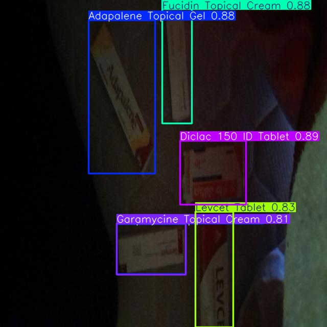
        <br/><i>Low light conditions</i>
      </td>
      <td align="center">
        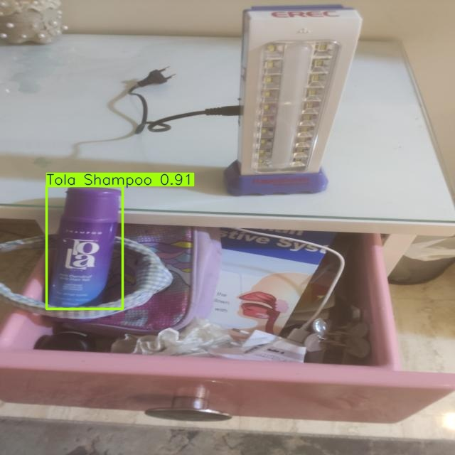
        <br/><i>Cluttered background with unrelated objects</i>
      </td>
    </tr>
    <tr>
      <td align="center">
        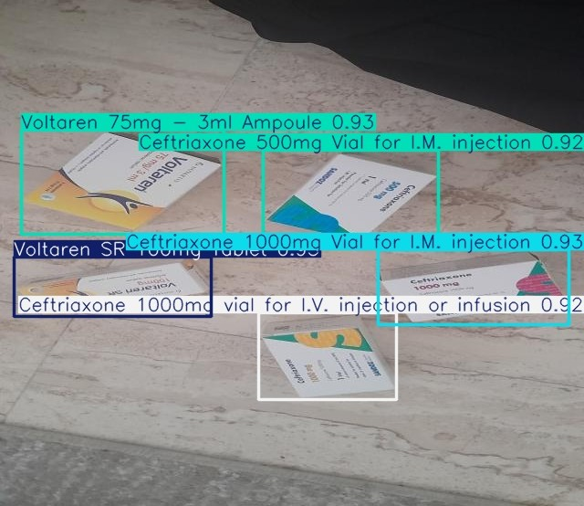
        <br/><i>Multiple visually similar drug variants</i>
      </td>
      <td align="center">
        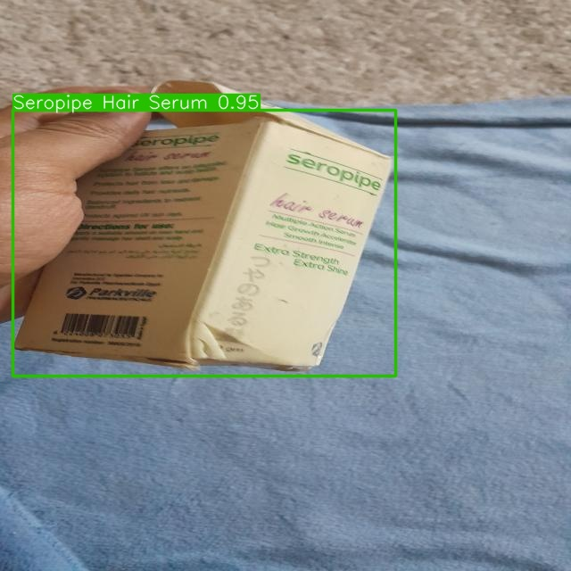
        <br/><i>Partially damaged packaging</i>
      </td>
    </tr>
  </table>
</div>

---

## Deployment

### Production — WebSocket Server

The production server is built with **FastAPI + ONNX Runtime** and served on Railway. It accepts JPEG frame bytes over WebSocket, runs inference, and returns structured JSON with detection coordinates.

The reference server implementation with full inference logic is at [`deployment/websocket/websocket_server/server.py`](deployment/websocket/websocket_server/server.py).

**Key implementation details:**
- ONNX Runtime with `CUDAExecutionProvider` → `CPUExecutionProvider` fallback
- Model warmup on startup with a zero tensor to eliminate cold-start latency
- Inference runs via `asyncio.to_thread` — does not block the async event loop
- `MIN_BOX_AREA` filter removes small false positive detections
- Environment variable configuration for confidence threshold, timeout, log level, and port

### Alternative — gRPC Server

A gRPC implementation with bidirectional streaming is available at [`deployment/grpc/`](deployment/grpc/). It uses the same YOLO inference logic but communicates over gRPC protocol on port 50051. This implementation uses PyTorch weights (`best.pt`) instead of ONNX and was not used in production.

---

## WebSocket API Reference

**Endpoint:** `wss://<host>/ws/detect`

**Request:** Raw JPEG image bytes sent as a binary WebSocket message. The server expects images at 640×640 — frames will be resized automatically if needed.

**Response:** JSON object

```json
{
  "request_id": "uuid",
  "timestamp": 1718000000.0,
  "processing_time_ms": 42.3,
  "detections": [
    {
      "detection_id": "uuid",
      "class_id": 12,
      "leftmost": [210.4, 430.1],
      "rightmost": [380.7, 215.3],
      "notify_point": [250.6, 253.8]
    }
  ],
  "error": null
}
```

**Response fields:**

| Field | Description |
|---|---|
| `class_id` | Integer index corresponding to a drug class in the dataset |
| `leftmost` | `[x, y]` of the bottom-left corner of the bounding box |
| `rightmost` | `[x, y]` of the top-right corner of the bounding box |
| `notify_point` | `[x, y]` rendered on screen to indicate a detected drug (25% inset from top-left of box) |

The mobile app uses `leftmost` and `rightmost` to determine whether a user's tap falls inside a detection. The `notify_point` is the only visual element shown on screen. When a tap matches a detection, the `detection_id` is sent to the backend to retrieve drug information and add it to the cart.

---

## Running Locally

### WebSocket Server

```bash
cd deployment/websocket/websocket_server

pip install fastapi uvicorn onnxruntime-gpu opencv-python numpy pydantic

# Place best.onnx in this folder

python server.py
```

Server starts on `http://0.0.0.0:7860`. WebSocket endpoint: `ws://localhost:7860/ws/detect`

**Environment variables (optional):**

| Variable | Default | Description |
|---|---|---|
| `MODEL_CONFIDENCE` | `0.5` | Detection confidence threshold |
| `MIN_BOX_AREA` | `1000` | Minimum bounding box area in pixels — smaller detections are discarded |
| `WS_TIMEOUT` | `30.0` | Seconds before a connection times out waiting for a frame |
| `PORT` | `7860` | Server port |
| `LOG_LEVEL` | `INFO` | Logging verbosity |

### WebSocket Test Client

```bash
cd deployment/websocket/websocket_test

# Place a test image as test.jpg in this folder
python test.py
# Output saved to output.jpg with detections drawn
```

### gRPC Server

```bash
pip install grpcio ultralytics opencv-python numpy

python deployment/grpc/grpc_server/server.py
# Server starts on port 50051
```

### gRPC Test Client

```bash
cd deployment/grpc/grpc_test

# Place a test image as test.jpg in this folder
python test.py
# Output saved to output.jpg with detections drawn
```

---

## Model Testing Utilities

**Batch image detection** — runs inference on a folder of images and saves annotated outputs:

```bash
# Edit MODEL_PATH, IMAGES_FOLDER_PATH, OUTPUT_FOLDER_PATH in image_detection.py
python model_development/model_tests/images_detection/image_detection.py
```

**Live camera detection** — runs real-time inference on a webcam feed with FPS counter, pause, and screenshot:

```bash
cd model_development/model_tests/live_detection
# Open live_camera_detection.ipynb and set MODEL_PATH
# Controls: Q to quit, S to pause, P to save screenshot
```

---

## ONNX Export

The production server uses ONNX format for framework-independent inference. To export `best.pt` to `best.onnx`:

```bash
cd model_development/onnx_transformer
# Open transform.ipynb, Edit MODEL_PATH and run
```

---

## Drug Database

[`drug_database/drugs_data.csv`](drug_database/drugs_data.csv) contains the structured drug data used by the pharmacy backend. It maps each of the 46 detectable drug classes to product information including name, category, prices, and packaging details.

The Roboflow dataset with class names, annotations, and all dataset versions is available at the link in [`drug_database/dataset_link.txt`](drug_database/dataset_link.txt).

---

## Documentation

Full system documentation, diagrams, and project proposal are in [`documentations_and_representations/`](documentations_and_representations/).

| File | Description |
|---|---|
| `FastAF_documentation.pdf` | Complete system documentation |
| `FastAF_presentation.pptx` | Project presentation |
| `proposal/graduation_project_proposal_final.pdf` | Final project proposal |

### System Diagrams

<div align="center">
  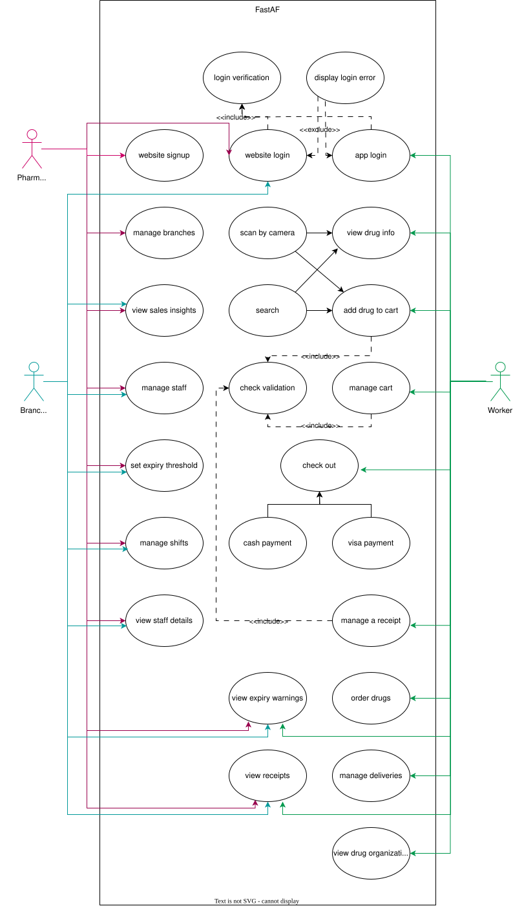
  <p><i>Use case diagram — actors and system interactions across the web dashboard, mobile app, and backend</i></p>
</div>

<div align="center">
  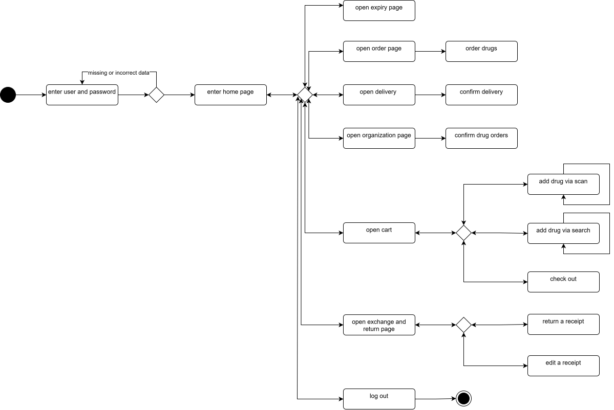
  <p><i>Activity diagram — mobile application flow covering login, sales, drug detection, expiry monitoring, and drug ordering</i></p>
</div>

<div align="center">
  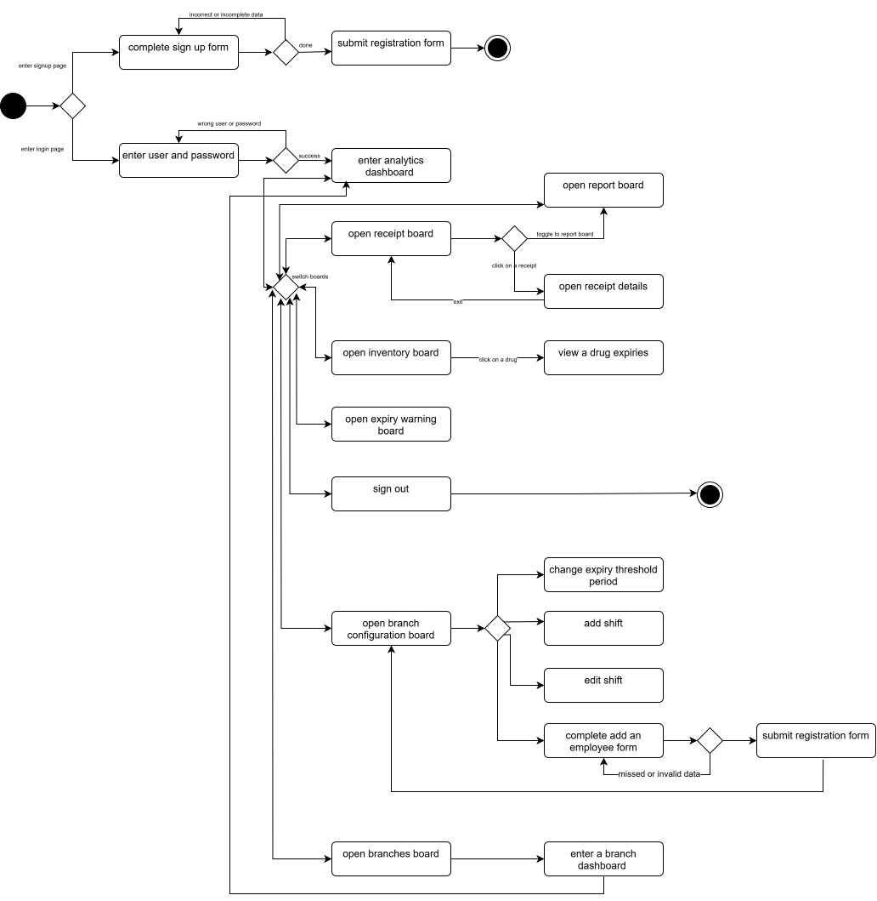
  <p><i>Activity diagram — web dashboard flow covering branch management, employee accounts, and sales analytics</i></p>
</div>

---

## My Role

I was the **AI engineer**, **team leader**, and **project idea originator** for FastAF. My responsibilities covered:

- **AI pipeline** — dataset planning, manual data collection, annotation, model training across 4 iterations, ONNX export, and the production WebSocket inference server
- **System design** — all UML diagrams (use case, sequence, activity diagrams for both the mobile app and web dashboard)
- **Documentation** — system technical documentation, presentation and project proposals
- **Team leadership** — project management and coordination across the full team

The mobile application and web dashboard were developed by the rest of the team.

---

## Tech Stack

| Component | Technology |
|---|---|
| Detection model | YOLOv11m (Ultralytics) |
| Inference runtime | ONNX Runtime (CUDAExecutionProvider) |
| API server | FastAPI + Uvicorn |
| Communication | WebSocket (production), gRPC (alternative) |
| Training hardware | Google Colab — Tesla T4 GPU |
| Dataset platform | Roboflow |
| Deployment | Railway |

---

## Author

**Moaaz Ahmed**
- GitHub: [@Moaaz Ahmed](https://github.com/MoaazSalter)